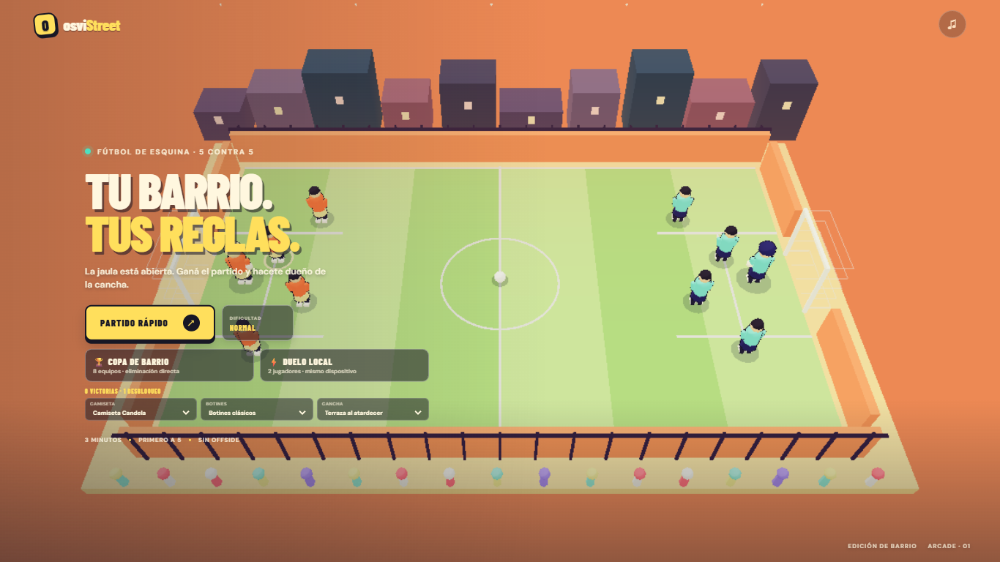
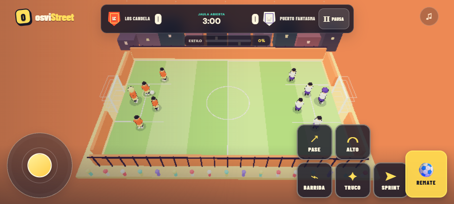
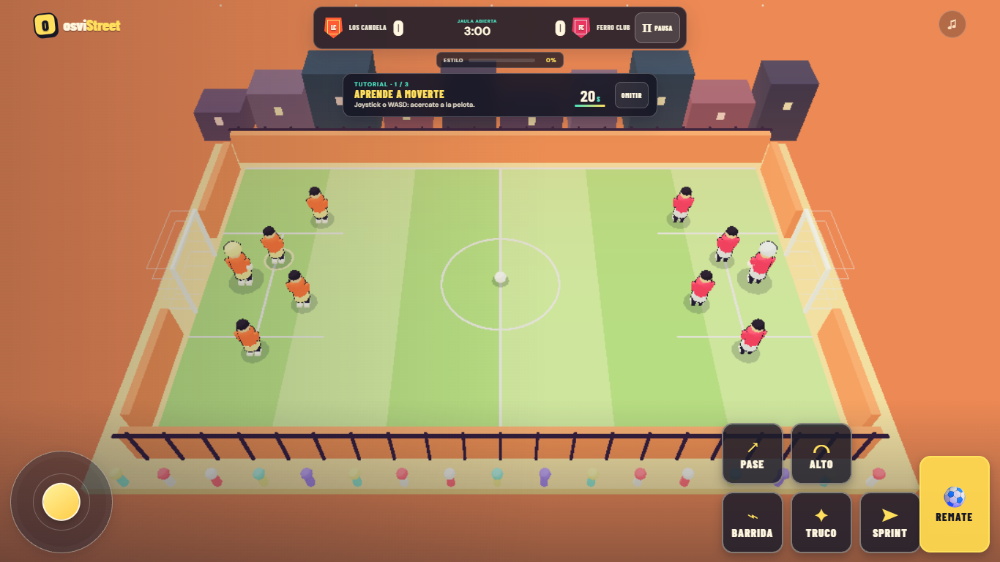
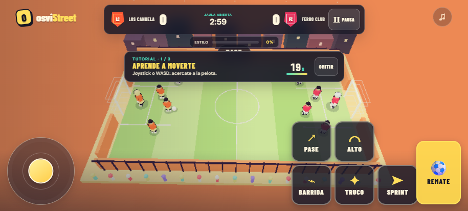

# CALIDAD

## Referencias: qué resuelven bien

La vara es que se entienda rápido, cada entrada produzca una respuesta clara y haya un motivo visible para volver. Esto resume las páginas públicas de los juegos; no es una afirmación de que sus interfaces o contenido deban copiarse.

| Área | Observación de referencia |
| --- | --- |
| Primeros 30 segundos | **Football Legends** ofrece partido rápido y torneo; **Soccer Skills** vincula arrastrar con movimiento y potencia de tiro; **Penalty Shooters 2** plantea de inmediato una tanda con roles de pateador y arquero. **Smash Karts** concentra la acción en partidas de tres minutos. Las fichas dejan claro qué se hace y cuánto dura el ciclo. |
| Sensación al jugar | **Soccer Skills** hace que dirección e intensidad del arrastre cambien el movimiento y el remate. **Penalty Shooters 2** convierte apuntar, soltar y leer al arquero en una decisión de tiempo. **Football Legends** da acciones diferenciadas —barrida, tiro y jugada especial—; **Drift Hunters** premia sostener el derrape y ajustar el auto; **Madalin Stunt Cars** permite buscar saltos y trucos; **Smash Karts** suma objetos que alteran cada persecución. Cada juego ofrece decisiones legibles con consecuencias inmediatas. |
| Gráficos | **Soccer Skills** y **Drift Hunters** se presentan en 3D; **Madalin Stunt Cars** ofrece mapas amplios con rampas y pistas; **Smash Karts** usa una arena 3D de lectura rápida. **Football Legends** conserva siluetas simples y contrastadas. La presentación acompaña el tipo de juego y deja que el objetivo se lea rápido. |
| Sonido | Las fichas públicas consultadas no describen música, mezcla ni efectos de **Football Legends**, **Soccer Skills**, **Penalty Shooters 2**, **Drift Hunters**, **Madalin Stunt Cars** o **Smash Karts**. No atribuyo una ventaja de audio a un título sin comprobarla. Para osviStreet, la vara será que pelota, pared, barrida, truco, gol e interfaz tengan señales propias; menú, partido y público deben tener niveles controlables. |
| Progresión | **Penalty Shooters 2** arma una copa de eliminación con tensión creciente. **Drift Hunters** convierte puntos de derrape en autos, tuning y circuitos. **Smash Karts** premia partidas con experiencia, niveles, monedas y cosméticos. **Football Legends** agrega torneo al partido rápido y **Soccer Skills** lleva al jugador por rondas de copa. Los premios se conectan con una acción concreta y una siguiente meta visible. |

### Fuentes de referencia

- [Football Legends · Poki](https://poki.com/en/g/football-legends)
- [Soccer Skills Champions League · Poki](https://poki.com/en/g/soccer-skills-champions-league)
- [Penalty Shooters 2 · Poki](https://poki.com/es/g/penalty-shooters-2)
- [Drift Hunters · CrazyGames](https://www.crazygames.com/game/drift-hunters)
- [Madalin Stunt Cars 2 · CrazyGames](https://www.crazygames.com/game/madalin-stunt-cars-2)
- [Smash Karts · CrazyGames](https://www.crazygames.com/game/smash-karts)

## Línea de base de osviStreet

Escala de 1 a 10, contra la vara de producto terminado pedida para este trabajo. Inspeccioné el menú y un partido en escritorio y en 915 × 412. El botón de pase respondió y mostró confirmación. La partida de prueba que dejé sin mover terminó 0–5; no cuenta como medición de dificultad porque no jugué el partido. La carpeta `assets-cc0` no existe, así que el renderer actual usa modelos y materiales procedurales.

| Área | Nota inicial | Evidencia y brecha |
| --- | ---: | --- |
| Primeros 30 segundos | 5/10 | Se puede iniciar un partido o elegir copa/duelo desde una portada clara. No hay tutorial jugable, los controles no se anticipan y a 915 × 412 los rótulos y el vestuario se comprimen demasiado. |
| Sensación al jugar | 4/10 | Hay confirmaciones visuales, cámara lenta y respuestas para algunos eventos. Pase y barrida son botones independientes, pero falta medir y mejorar su comodidad táctil. La sesión sin intervención acabó antes de evaluar el control sostenido; la IA rival marcó cinco goles mientras el usuario no movía a su jugador. |
| Gráficos | 5/10 | Paleta toon coherente, cancha reconocible, 10 jugadores, escudos y cuatro identidades de cancha. Los personajes, la multitud y la ciudad son geométricos y repetitivos; no hay bloom ni animación articulada de carrera, golpeo, atajada o celebración. |
| Sonido | 3/10 | Hay ambiente, música y sonidos sintetizados para golpe, pared, truco, gol y atajada. El audio empieza silenciado, no hay canales independientes ni señal sonora de botones, pase por arriba, barrida y sprint. |
| Progresión | 3/10 | Copa y siete cosméticos/canchas desbloqueables por victorias. No hay monedas, niveles, premios por progreso, desafío diario, récord local, logros ni botón grande de revancha en todas las salidas. |

**Puntuación inicial:** 20/50. Las fotos de base muestran que la escena se sostiene mejor en escritorio que en el encuadre móvil.

### Capturas de antes

Escritorio, 1366 × 768:

Partido y controles, 915 × 412:

También se guardaron las cuatro vistas de menú y partido en ambos tamaños en `outputs/captures/round-0/`.

## Ronda 1 · controles, entrada e IA

| Área | Nota | Cambio observado |
| --- | ---: | --- |
| Primeros 30 segundos | 7/10 | El primer partido rápido arranca en Tranqui y presenta un tutorial de tres acciones con contador de 20 segundos y botón para omitir. La portada móvil todavía queda apretada. |
| Sensación al jugar | 6/10 | Los botones táctiles ahora miden 78 × 78 px a 915 × 412; el remate mide 87 × 124 px. La primera jaula tiene asistencia cuando el jugador no da entrada y sus compañeros corren a carriles más abiertos. Ganar sube la dificultad si el jugador no eligió una manualmente. |
| Gráficos | 5/10 | Sin cambio de contenido: los modelos todavía son de baja complejidad y carecen de animación articulada. |
| Sonido | 3/10 | Sin cambio: siguen faltando canales separados y efectos para cada acción y botón. |
| Progresión | 3/10 | El aumento de dificultad hace que la revancha escale, pero todavía faltan monedas, niveles, desafío diario, récords y logros. |

**Puntuación de ronda 1:** 24/50. La prueba móvil confirmó las dimensiones de los botones, el tutorial completo en pantalla y su botón **Omitir**. El test de IA verificó asistencia con entrada inactiva y una victoria simulada para la primera partida con el jugador quieto. La simulación de 200 partidos pasó el margen de 5–7 goles y no tuvo partidos sin remates; Vitest no expuso el promedio exacto en su resumen.

### Capturas de ronda 1

Partido a 1366 × 768:

Partido a 915 × 412:

Menú en ambos tamaños y capturas originales están en `outputs/captures/round-1/` y `outputs/captures/round-0/`.

## Ronda 2 · animación, audio y carrera

| Área | Nota | Cambio observado |
| --- | ---: | --- |
| Primeros 30 segundos | 7/10 | La portada suma nivel, XP y monedas ganadas. El menú no explica todavía el reto del día ni qué se puede comprar con las monedas. |
| Sensación al jugar | 7/10 | Brazos y piernas acompañan el movimiento; el arquero inclina el cuerpo al desplazarse. Pase, barrida e interfaz tienen tonos propios. No probé la mezcla con auriculares ni toqué una pantalla física. |
| Gráficos | 6/10 | Los modelos toon ganan detalles de camiseta, cara, medias y articulaciones animadas. Se mantiene la geometría procedural sin modelos CC0, texturas ni postprocesado. |
| Sonido | 5/10 | Música de menú y partido con frases diferentes, y controles separados para música, efectos e hinchada. El volumen se guarda en el dispositivo. Los instrumentos y efectos siguen sintetizados. |
| Progresión | 4/10 | Cada partido entrega monedas y XP; el nivel y la barra al siguiente umbral quedan visibles. Las monedas aún no se gastan; faltan desafío diario, récord local y logros. |

**Puntuación de ronda 2:** 29/50. La pantalla de menú y el partido se capturaron en ambos tamaños. En 915 × 412 la fila de nivel queda dentro del área visible; las cifras de monedas son pequeñas y necesitan una fila de progreso más legible en una próxima pasada.

### Capturas comparables de ronda 2

Antes: menú a 915 × 412 y partido a 1366 × 768, en [`round-1/`](outputs/captures/round-1/). Después: [menú a 915 × 412](outputs/captures/round-2-after/menu-915x412.png) y [partido a 1366 × 768](outputs/captures/round-2-after/match-1366x768.png). Las otras dos vistas están junto a estas en `round-2-after/`.

La corrida experimental de 200 partidos a 30 Hz dio 7,995 goles y se descartó porque cambió el balance. La simulación completa a 60 Hz registró **5,525 goles** y **39,26 remates** de promedio, con **cero partidos sin remates**; los resultados fueron 78 victorias locales, 77 visitantes y 45 empates. Una repetición local fue detenida tras más de 19 minutos al seguir ocupando la máquina. Optimicé el contador de eventos, que antes recorría la cola cada frame incluso si no había eventos nuevos. La suite completa, incluido el test de simulación de 200 partidos, pasó en el workflow del commit `fffcd99`; también publicó APK debug y Pages: [ejecución 36234266361](https://github.com/biancogianluca19-bit/osviStreet/actions/runs/36234266361).

## Ronda 3 · tienda, desafío diario y logros

| Área | Nota | Cambio observado |
| --- | ---: | --- |
| Primeros 30 segundos | 8/10 | La portada destaca el botón de partido y presenta un desafío jugable del día con premio. La carrera, su moneda y el siguiente cosmético están visibles sin entrar a otra pantalla. |
| Sensación al jugar | 7/10 | Volví a tocar Pase y Barrida con emulación táctil a 915 × 412; ambos botones recibieron el toque y pusieron la acción en cola. Sus áreas grandes siguen dentro del borde inferior. |
| Gráficos | 6/10 | La portada organiza vestuario y carrera en tarjetas con la misma paleta y tipografía. Los modelos, contornos toon, cámara y cancha 3D no cambiaron esta ronda. |
| Sonido | 5/10 | Sin cambios en música, mezcla ni efectos. |
| Progresión | 8/10 | Las monedas compran siete artículos cosméticos; una compra equipa el objeto y persiste. Hay cuatro retos diarios rotativos, premio único por completar, cinco récords locales, barra al siguiente artículo y quince logros con avances guardados. |

**Puntuación de ronda 3:** 34/50. Comparé las capturas de ronda 2 con las nuevas en 1366 × 768 y 915 × 412. La tarjeta de carrera queda a 56 px del borde superior y 28 px del inferior en 915 × 412. Revisé también la lista desplazable de logros; los quince artículos existen, sin recorte horizontal.

### Capturas comparables de ronda 3

Antes: [menú a 915 × 412](outputs/captures/round-2-after/menu-915x412.png) y [partido a 1366 × 768](outputs/captures/round-2-after/match-1366x768.png). Después: [menú a 915 × 412](outputs/captures/round-3-after/menu-915x412.png), [partido a 915 × 412](outputs/captures/round-3-after/match-915x412.png), [logros en móvil](outputs/captures/round-3-after/achievements-915x412.png) y [menú a 1366 × 768](outputs/captures/round-3-after/menu-1366x768.png).

## Puntuaciones por ronda

| Ronda | Primeros 30 s | Sensación | Gráficos | Sonido | Progresión | Total |
| --- | ---: | ---: | ---: | ---: | ---: | ---: |
| Base · 2026-09-25 | 5 | 4 | 5 | 3 | 3 | 20/50 |
| Ronda 1 · 2026-09-26 | 7 | 6 | 5 | 3 | 3 | 24/50 |
| Ronda 2 · 2026-09-26 | 7 | 7 | 6 | 5 | 4 | 29/50 |
| Ronda 3 · 2026-09-26 | 8 | 7 | 6 | 5 | 8 | 34/50 |
| Ronda 4 · 2026-09-26 | 8 | 8 | 7 | 5 | 8 | 36/50 |
| Ronda 5 · 2026-09-26 | 9 | 8 | 7 | 5 | 8 | 37/50 |
| Ronda 6 · 2026-09-26 | 9 | 8 | 7 | 6 | 8 | 38/50 |
| Ronda 7 · 2026-09-26 | 9 | 9 | 8 | 6 | 8 | 40/50 |
| Ronda 8 · 2026-09-26 | 9 | 9 | 8 | 6 | 8 | 40/50 |

## Ronda 4 · respuesta a los impactos

| Área | Nota | Cambio observado |
| --- | ---: | --- |
| Primeros 30 segundos | 8/10 | El tutorial y el menú de carrera siguen visibles; no cambiaron esta ronda. |
| Sensación al jugar | 8/10 | Gol, remate, truco, barrida, atajada y rebote disparan un pulso háptico breve cuando el navegador lo permite. El toque de cámara dura 200 ms y escala según la fuerza del evento. |
| Gráficos | 7/10 | Los impactos mueven suavemente el encuadre; la celebración de gol suma un golpe de cámara más marcado. |
| Sonido | 5/10 | Conserva la mezcla y los sonidos de la ronda anterior; esta ronda no agrega muestras nuevas. |
| Progresión | 8/10 | Tienda, carrera, récords, reto diario y quince logros permanecen sin cambios. |

**Puntuación de ronda 4:** 36/50. Revisé las capturas de menú y partido en 1366 × 768 y 915 × 412. El tutorial y los controles táctiles entran en ambos tamaños; no hay controles recortados. Las capturas muestran el estado neutro, así que el movimiento de cámara se verifica durante eventos, no en una imagen fija.

### Capturas comparables de ronda 4

Antes: [partido a 915 × 412](outputs/captures/round-3-after/match-915x412.png). Después: [menú a 1366 × 768](outputs/captures/round-4-after/menu-1366x768.png), [partido a 1366 × 768](outputs/captures/round-4-after/match-1366x768.png), [menú a 915 × 412](outputs/captures/round-4-after/menu-915x412.png) y [partido a 915 × 412](outputs/captures/round-4-after/match-915x412.png).

## Ronda 5 · carga inicial ligera

| Área | Nota | Cambio observado |
| --- | ---: | --- |
| Primeros 30 segundos | 9/10 | El menú aparece sin esperar el módulo 3D. En una prueba con 4G simulado, CPU 4× y caché fría, el evento de carga terminó en 1,06 s en escritorio y 1,42 s en 915 × 412. |
| Sensación al jugar | 8/10 | El jugador ve una cancha de espera y puede pulsar Partido mientras carga el renderer; el botón muestra el estado de carga. La cancha 3D quedó lista 5,01 s después del toque en escritorio y 3,47 s en móvil bajo esa simulación. |
| Gráficos | 7/10 | La portada usa una cancha CSS liviana hasta que se solicita un partido; la vista de juego sigue renderizándose en Three.js. |
| Sonido | 5/10 | Sin cambios en la mezcla, música ni muestras. |
| Progresión | 8/10 | Tutorial, carrera, premios y modos sin cambios. |

**Puntuación de ronda 5:** 37/50. La entrada JS bajó de 588,41 kB a 64,43 kB sin comprimir (de 157,27 a 21,85 kB gzip); Three.js quedó en un chunk separado de 524,24 kB (135,51 kB gzip). El test usó Chrome headless con aceleración SwiftShader, caché desactivada, 120 ms de latencia, 200 kB/s y CPU 4×. Sirve para comparar carga y flujo; no reemplaza un teléfono real ni una red móvil física.

### Capturas comparables de ronda 5

Antes: [menú móvil](outputs/captures/round-4-after/menu-915x412.png) y [partido móvil](outputs/captures/round-4-after/match-915x412.png). Después: [menú 1366 × 768](outputs/captures/round-5-after/menu-1366x768.png), [partido 1366 × 768](outputs/captures/round-5-after/match-1366x768.png), [menú 915 × 412](outputs/captures/round-5-after/menu-915x412.png) y [partido 915 × 412](outputs/captures/round-5-after/match-915x412.png).

## Ronda 6 · música y efectos por capas

| Área | Nota | Cambio observado |
| --- | ---: | --- |
| Primeros 30 segundos | 9/10 | El menú y la entrada liviana del juego no cambiaron esta ronda. |
| Sensación al jugar | 8/10 | Pase, remate, barrida, truco, pared y botón de interfaz ahora tienen transitorios y tonos distintos. La secuencia musical usa un planificador con anticipación de 120 ms para evitar el ritmo irregular de un `setInterval` musical. |
| Gráficos | 7/10 | Sin cambios visuales. Revisé el menú y el partido en ambas resoluciones después de la mezcla nueva; los controles siguen completos en 915 × 412. |
| Sonido | 6/10 | Menú y partido tienen arreglos de cuatro compases distintos, con bajo, acordes, percusión y melodía. Los goles suman fanfarria y dos capas de hinchada. Sigue siendo audio sintetizado. |
| Progresión | 8/10 | Sin cambios. |

**Puntuación de ronda 6:** 38/50. Con Chrome headless, el contexto de audio quedó en estado `running` en 1366 × 768 y 915 × 412; no aparecieron errores de ejecución y el renderer mostró la cancha 3D. `pnpm build` pasó y los 38 tests pasaron, incluida la simulación de 200 partidos: promedio de 5,525 goles, 39,26 remates y cero partidos sin remates. Vite sigue avisando que el chunk diferido de Three.js supera 500 kB. El navegador usó SwiftShader; esto no verifica audio físico ni 60 FPS en Android.

### Capturas comparables de ronda 6

Antes: [menú móvil](outputs/captures/round-5-after/menu-915x412.png) y [partido móvil](outputs/captures/round-5-after/match-915x412.png). Después: [menú 1366 × 768](outputs/captures/round-6-after/menu-1366x768.png), [partido 1366 × 768](outputs/captures/round-6-after/match-1366x768.png), [menú 915 × 412](outputs/captures/round-6-after/menu-915x412.png) y [partido 915 × 412](outputs/captures/round-6-after/match-915x412.png).

## Ronda 7 · poses de acción y respuesta visual

| Área | Nota | Cambio observado |
| --- | ---: | --- |
| Primeros 30 segundos | 9/10 | El menú y el inicio rápido se mantienen; esta ronda no cambió el flujo inicial. |
| Sensación al jugar | 9/10 | Rematar, pasar, barrerse, atajar y recibir una falta activan poses articuladas. La barrida baja al jugador y lo extiende sobre el piso; un remate lleva el cuerpo y la pierna de apoyo hacia adelante. |
| Gráficos | 8/10 | Las acciones suman polvo de barrida, destellos de golpe y ráfagas de color. La celebración alterna saltos y patadas; el arquero se lanza hacia el balón. Los modelos siguen siendo geométricos y el render aún no usa posprocesado. |
| Sonido | 6/10 | Sin cambios en la mezcla ni en los efectos sintetizados. |
| Progresión | 8/10 | Sin cambios en tienda, monedas, retos ni logros. |

**Puntuación de ronda 7:** 40/50. En Chrome headless a 915 × 412, accioné remate y barrida: ambos mostraron el aviso correspondiente, el navegador registró cero errores y los botones midieron 78 × 78 px (remate 87 × 124 px). La barrida se distingue en una imagen fija. La pierna del remate y las poses de atajada/falta son difíciles de juzgar en capturas pequeñas, así que necesitan revisión en movimiento. Ejecuté `pnpm test` (38/38) y `pnpm build`; la simulación mantuvo 5,525 goles, 39,26 remates por partido y cero partidos sin remates. El test visual usó Chrome con SwiftShader y eventos de mouse; no equivale a una pantalla táctil ni a un teléfono Android.

### Capturas comparables de ronda 7

Antes: [partido 1366 × 768](outputs/captures/round-6-after/match-1366x768.png) y [partido 915 × 412](outputs/captures/round-6-after/match-915x412.png). Después: [partido 1366 × 768](outputs/captures/round-7-after/match-1366x768.png), [partido 915 × 412](outputs/captures/round-7-after/match-915x412.png), [remate en 915 × 412](outputs/captures/round-7-after/action-kick-915x412.png) y [barrida en 915 × 412](outputs/captures/round-7-after/action-slide-915x412.png). Menú de escritorio y móvil en `outputs/captures/round-7-after/`.

## Ronda 8 · controles táctiles y saques

| Área | Nota | Cambio observado |
| --- | ---: | --- |
| Primeros 30 segundos | 9/10 | Inicio rápido y tutorial sin cambios. |
| Sensación al jugar | 9/10 | El pase queda en espera hasta 1,8 s y puede sobrevivir el saque postgol de 1,45 s. El aviso distingue el saque pendiente de estar sin pelota. Remate, acciones y pausa tienen blancos más grandes. |
| Gráficos | 8/10 | Los botones tienen iconos y etiquetas mayores, manteniendo el campo dentro de pantalla. |
| Sonido | 6/10 | Sin cambios en la mezcla ni efectos sintetizados. |
| Progresión | 8/10 | Sin cambios. |

**Puntuación de ronda 8:** 40/50. Mantuve las notas: la interacción mejoró, pero sigue pendiente la prueba física y la comparación en movimiento para justificar una nota más alta. En Chrome con eventos táctiles emulados en 915 × 412, el pase tocado durante el saque produjo el evento `PASE`; la barrida produjo `BARRIDA`; Pausa abrió el panel y **SALIR AL MENÚ** devolvió a la portada. Cero errores JavaScript. Medidas: cinco botones de acción de 86 × 86 px, remate de 91 × 140 px y pausa de 68 × 46 px. En 1366 × 768 el menú, partido y controles entran. `pnpm test` pasó 41/41 en siete archivos, con 5,525 goles de promedio, 39,26 remates y cero partidos sin remates; `pnpm build` pasó. La prueba confirma que el reinicio del partido y el buffer comparten el tiempo definido; el navegador tocó durante el saque inicial de 0,65 s. El chunk 3D aún supera la advertencia de Vite de 500 kB.

### Capturas comparables de ronda 8

Antes: [partido móvil de ronda 7](outputs/captures/round-7-after/match-915x412.png). Después: [partido 1366 × 768](outputs/captures/round-8-after/match-1366x768.png), [partido 915 × 412](outputs/captures/round-8-after/match-915x412.png), [pase en saque](outputs/captures/round-8-after/action-pass-915x412.png), [barrida táctil](outputs/captures/round-8-after/action-slide-915x412.png) y [panel de pausa](outputs/captures/round-8-after/pause-915x412.png). Los menús de ambos tamaños también están en `outputs/captures/round-8-after/`.
